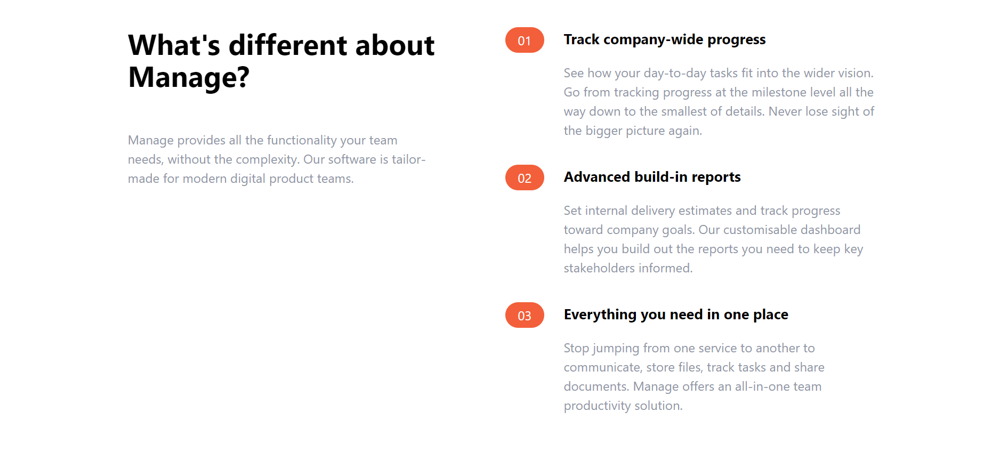

Manage Landing Page
    
## Table of Contents
* [Description](#description)
* [Images](#images)
* [Contributing](#contributing)
* [Questions](#questions)

## Description
This landing page for a faux brand "Manage" was created as a walk-through project from Travery Media's Tailwind CSS Crash Course video on Youtube.

Check out the video here!
https://www.youtube.com/watch?v=dFgzHOX84xQ

## Images

Hero Section:

Features Section:

Testimonials:

CTA Section and Footer:

## Contributing
Katrina Gucilatar following a step-by-step walk-through from Traversy Media's Tailwind CSS Crash Course video on Youtube.

Check out the video here!
https://www.youtube.com/watch?v=dFgzHOX84xQ

## Questions
Contact me at the following for any questions: 
GitHub: https://github.com/katgucilatar  
Email: katgucilatar@outlook.com